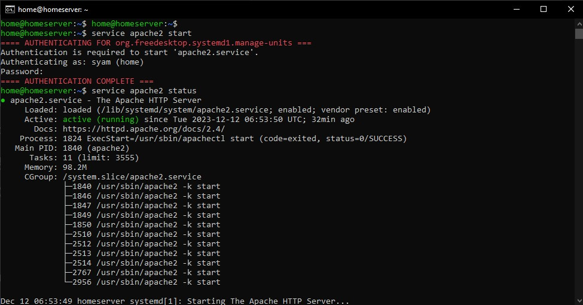
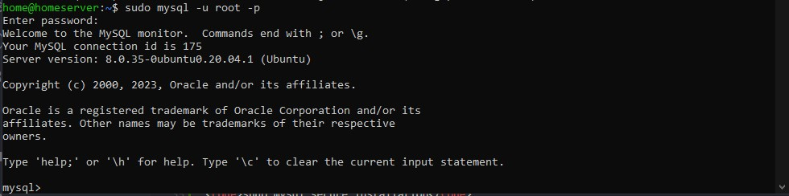
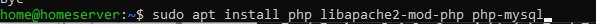
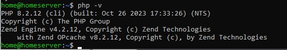
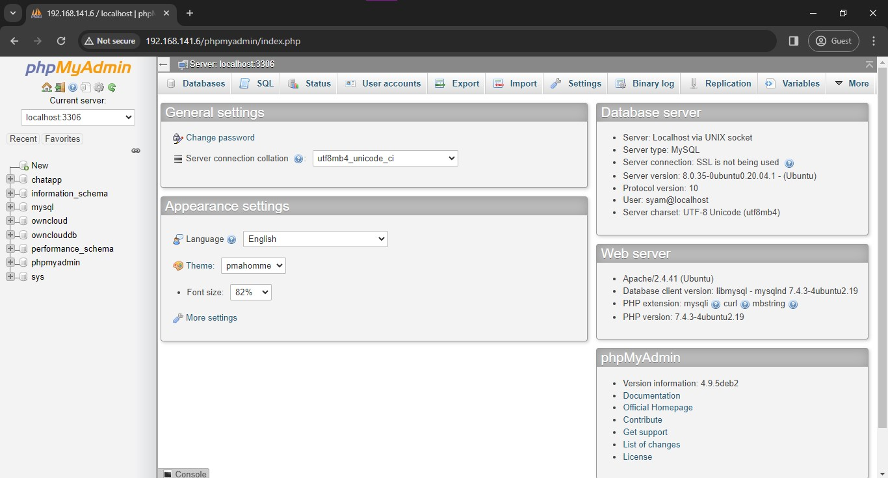

# Install LAMP
LAMP (Linux, Apache, MySQL-maridDB, PHP) pada sebuah server sebagai sebuah service untuk menjalakan sebuah web server atau sebagainya yang membutuhkan Apache ataupun Database

## Cara Installasi

### Install Apache
Service Apache diperuntukkan biasanya untuk web server, tata cara install Apache adalah menggunakan perintah

<code>sudo apt install apache2</code>

Sesudah di install cek Apache menggunakan perintah

<code>service apache2 start</code>

<code>service apache2 status</code>

Untuk akses ke sebuah webnya bisa menggunakan

<code>http://your_server_ip</code>

### Install MySQL
Service MySQL berfungsi sebagai sebuah penyedian database pada sebuah server, tata cara installasinya adalah menggunakan perintah

<code>sudo apt install mysql-server</code>

Setelah MySQL terpasang direkomendasikan untuk menambah keamanan atau security pada MySQL tersebut dengan menggunakan perintah

<code>sudo mysql_secure_installation</code>

Dan ikuti untuk pilihan pilihan yang direkomendasikan, dan setelah itu selesai buka MySQL dengan perintah

<code>sudo mysql</code>

### Install PHP
PHP berfungsi sebuah extension pada sebuah laman web, tata cara installasi PHP menggunakan perintah

<code>sudo apt install php libapache2-mod-php php-mysql</code>

Untuk cek version PHP yang di install bisa menggunakan perintah

<code>php -v</code>

## Install phpmyadmin
Fungsi phpmyadmin sama seperti mysql bedanya phpmyadmin menggunakan GUI atau tampilan agar memudahkan penggunanya mengontrol database.

Untuk installasi phpmyadmin dapat menggunakan perintah

<code>sudo apt install phpmyadmin php-mbstring php-zip php-gd php-json php-curl</code>

Setelah install phpmyadmin disarankan untuk restart Apache dengan perintah

<code>service apache2 restart</code>

Unntuk masuk phpmyadmin denga memasukkan ip ke browser dengan contoh berikut

<code>http://your_server_ip/phpmyadmin</code>

