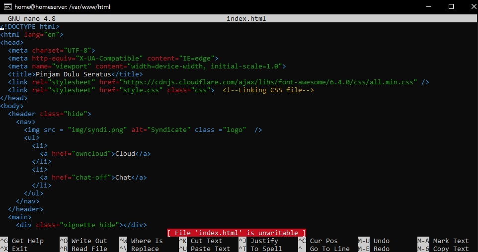
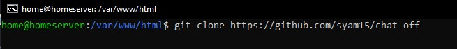

# Membangun Home Server dengan ubuntu server

  

  

## Apa itu Home Server?
Home Server ditujukan sebagai solusi untuk rumahan atau kantor dengan banyak komputer PC yang terkoneksi untuk menawarkan fitur file sharing, backup otomatis, dan juga akses secara jarak jauh.

## Bahan - bahan yang perlu di siapkan :
- virtualbox
- iso ubuntu server versi 20.04
- jaringan internet

Bagi yang belum mempunyai iso dan juga virtualbox bisa di dapatkan disini :
- https://www.virtualbox.org/wiki/Downloads
- https://releases.ubuntu.com/focal/
- https://mirror.unpad.ac.id/iso/ubuntu/20.04/
- https://kartolo.sby.datautama.net.id/ubuntu-cd/20.04/

## Alur installasi
- Membuat VM ubuntu server dengan virtualbox

<code>https://github.com/syam15/HomeServer/blob/main/installation%20ubuntu%20server%2020.04.md</code>

- Installasi LAMP untu kebutuhan Web Server

<code>https://github.com/syam15/HomeServer/blob/main/LAMP.md</code>

- Installasi docker

<code>https://github.com/syam15/HomeServer/blob/main/docker%20installation.md</code>

- Install owncloud dengan docker-compose

<code>https://github.com/syam15/HomeServer/blob/main/owncloud%20docker-compose.md</code>

## Setup Web Server
Membuat web server agar sedikit lebih menarik dan supaya tidak polosan.

- Membuat Codingan atau sebuah web untuk membuat tampilan server lebih menarik. Untuk membuat atau memasukkan codingannya bisa masuk pada directori html degan perintah <code>cd /var/www/html</code> dan edit bagian index.html ataupun extension file lainnya dan buat tampilan semenarik mungkin.

- Disini ditambahkan pula sebuah direktori yang bernama chat-off yang berfungsi sebagai pengantar pesan secara internal pada sebuah server atau disebut juga antar karyawan, dan untuk codingan di directori itu sendiri sudah ada di github <code>https://github.com/syam15/chat-off</code>. Untuk Memasukkannya bisa menggunakan git Clone, tapi sebelum di clone diharapkan untuk menginstall git dengan cara <code>sudo apt install git</code> dan untuk menclone nya dengan cara <code>git clone https://github.com/syam15/chat-off</code>

### Pesan-Pesan
Mungkin selanjutnya ada sebuah pengembangan lagi, tapi tergantung mood aja si