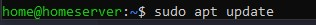

### REQUIREMENT PACKAGES:
<code>sudo apt update</code>
 
<code>sudo apt install apt-transport-https ca-certificates curl software-properties-common</code>
 

### GPG REPO:
<code>curl -fsSL https://download.docker.com/linux/ubuntu/gpg | sudo gpg --dearmor -o /usr/share/keyrings/docker-archive-keyring.gpg</code>

### APT REPO SOURCES:
<code>echo "deb [arch=$(dpkg --print-architecture) signed-by=/usr/share/keyrings/docker-archive-keyring.gpg] https://download.docker.com/linux/ubuntu $(lsb_release -cs) stable" | sudo tee /etc/apt/sources.list.d/docker.list > /dev/null</code>

### UPDATE INTERNAL REPO SYSTEM
<code>sudo apt update</code>

### verify repo from docker:
<code>apt-cache policy docker-ce</code>

### INSTALL:
<code>sudo apt install docker-ce</code>

### CHECK STATUS:
<code>sudo systemctl status docker</code>

### ROOTLESS:
<code>sudo usermod -aG docker ${USER}</code>

### Check Rootless:
<code>groups</code>

### check docker access:
<code>docker info</code>

