# Instalasi ubuntu server di VM

### Membuat VM
buka virtualbox dan buat vm dan masukkan iso ubuntu servernya

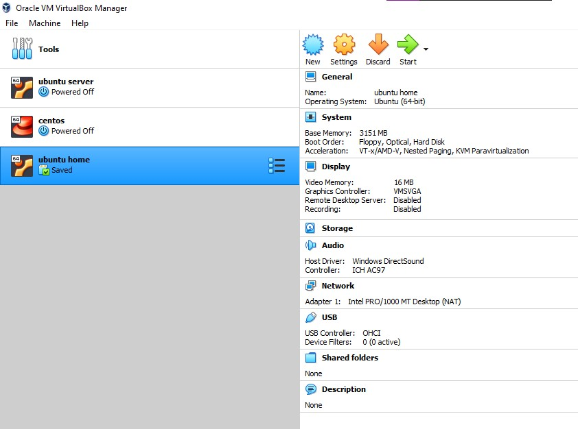

### Memilih bahasa
Pilih English lalu Enter

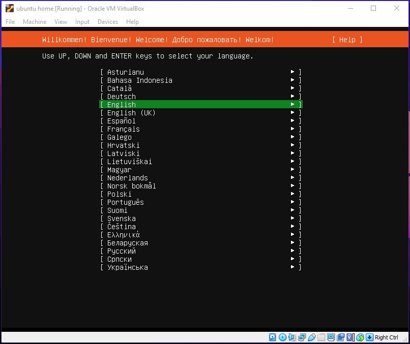

### Installer update
Pilih continue without updating

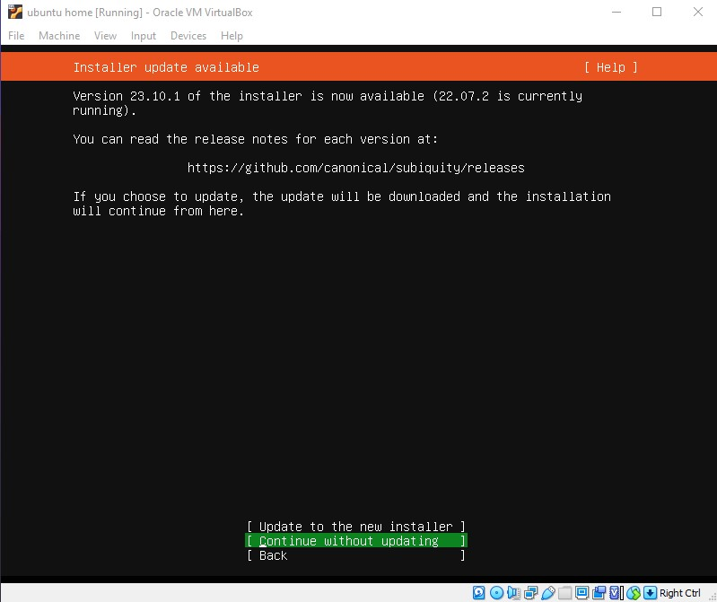

### Keyboard configuration
Pilih Done

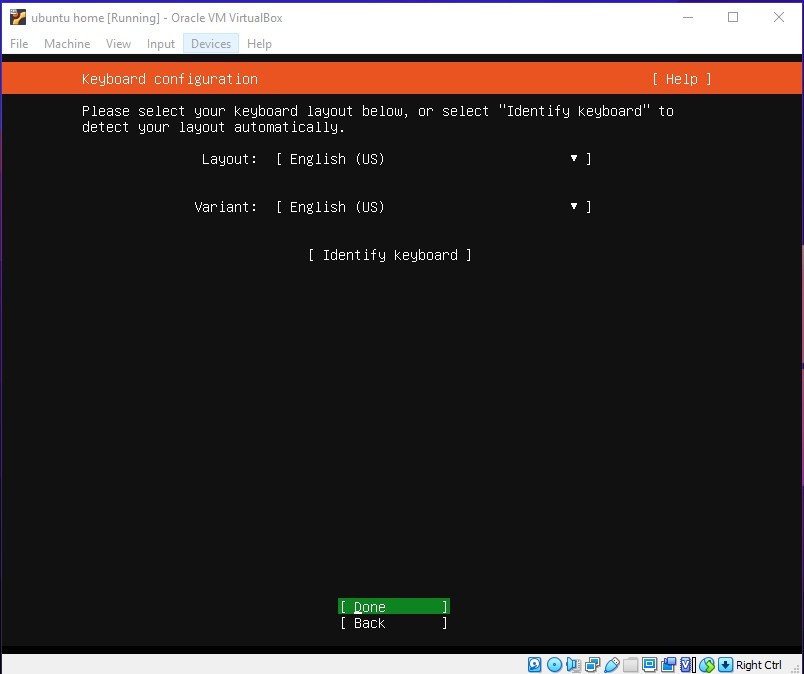

### Network Connetions
Pilih Done

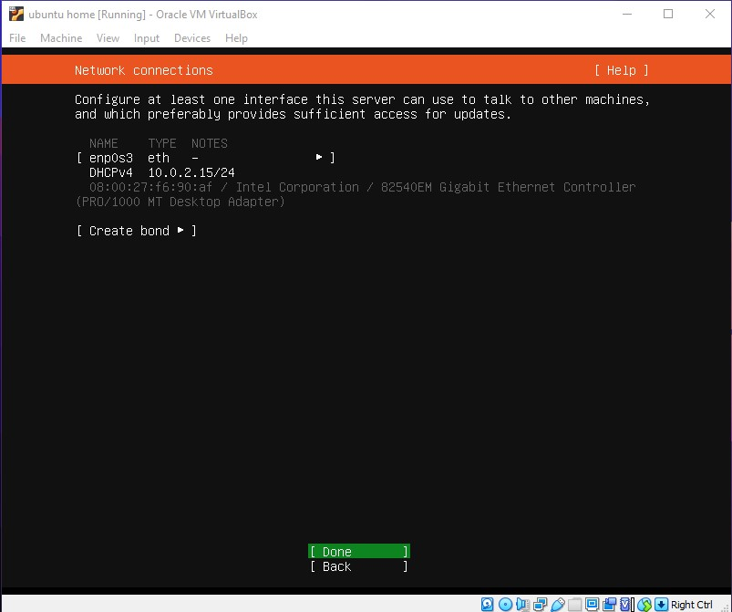

### Guide storage configuration
Pilih Done

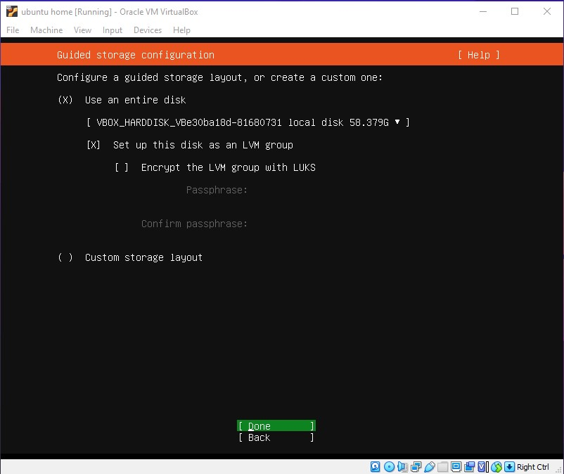

### Storage configuration
Pilih Done

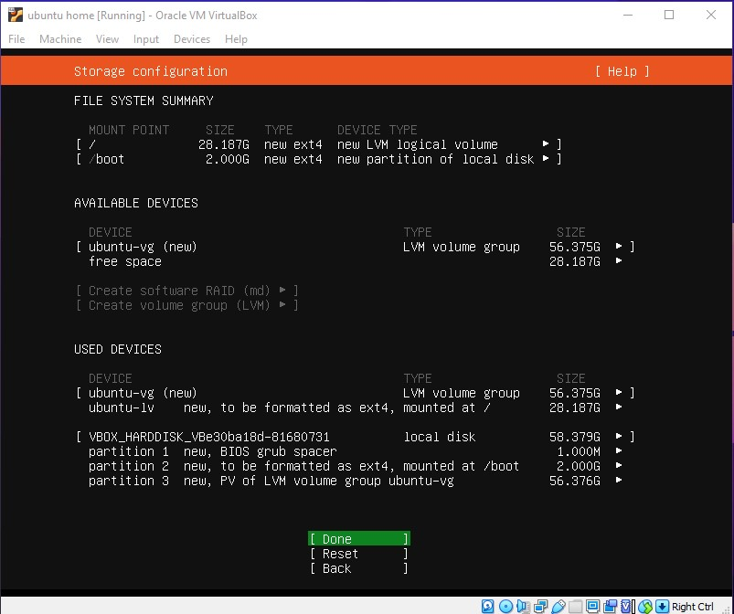

### Profile setup
Isi yang sesuai dengan keinginan dan pilih Done

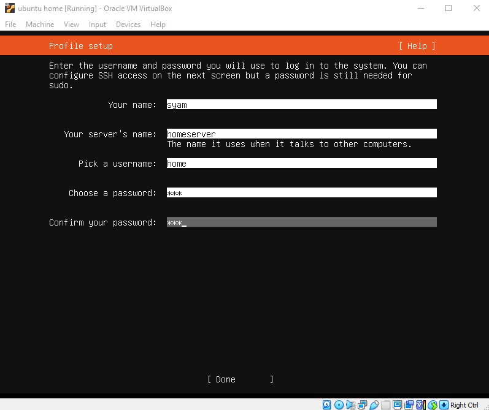

### SSH setup
centang install Openssh dengan spasi dan pilih Done

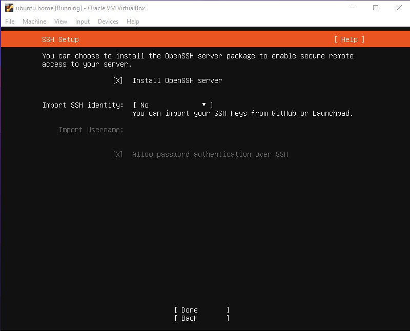

### Installing system
setelah installing system complate pilih reboot dan tunggu

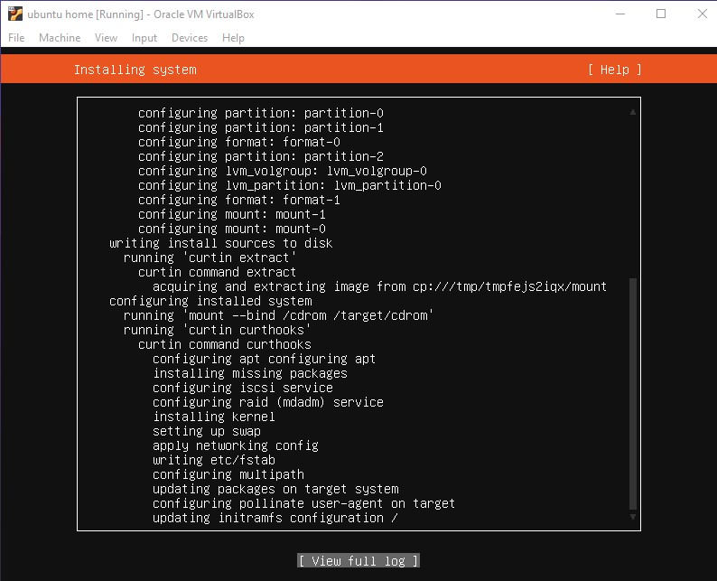

### remote dengan SSH
untuk mengkonesikan ssh dengan cara:
<code>ssh user@your_ip</code>

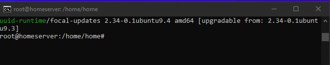