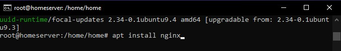
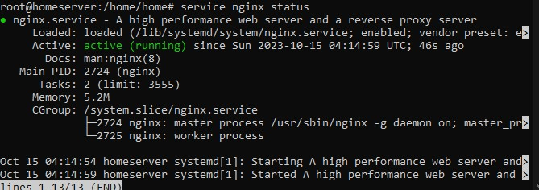
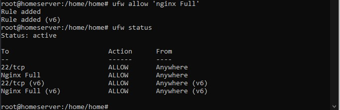
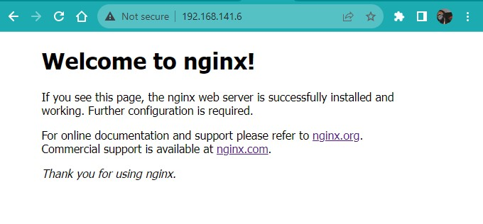

# Install Nginx
menginstall nginx untuk kebutuhan web server

## Cara Installasi

### Install nginx
<code>apt install nginx</code>

### Cek Status nginx
<code>service nginx status</code>

### Allow ufw
<code>ufw allow 'nginx Full'</code>

### Cek via browser
<code>https://your_ip</code>

