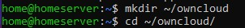

# Instalasi Owncloud Pada server
Owncloud berfungsi untuk membuat sebuah storage agar bisa berbagi antar local dalam satu jaringan agar pemindahan file lebih cepat

## Cara Installasi

### Membuat Direktori Baru
cara membuatnya adalah
<code>mkdir ~/owncloud</code>
cara masuk ke direktori
<code>cd ~/owncloud</code>

### Configurasi env
configurasi env dengan perintah

<code>nano .env</code>

Lalu Masukkan script berikut

<code>OWNCLOUD_VERSION=10.11
OWNCLOUD_DOMAIN=SERVER:8080
OWNCLOUD_TRUSTED_DOMAINS=(ip server)
ADMIN_USERNAME=home
ADMIN_PASSWORD=server
HTTP_PORT=8080</code>

### download owncloud yml file untuk docker-compose:

<code>wget https://raw.githubusercontent.com/owncloud/docs-server/master/modules/admin_manual/examples/installation/docker/docker-compose.yml</code>
